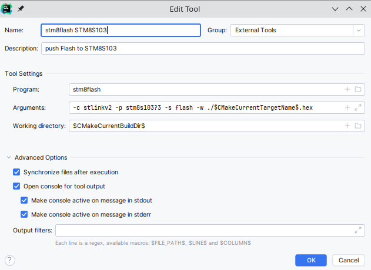
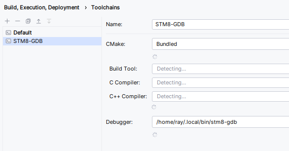
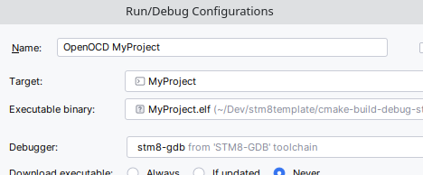

# Ray's STM8 CLion Template

## IMPORTANT NOTE:
I have recently converted this to a CLion Dev Container. I will update this documentation soon, but most of this can be ignored.  
## **\*\*\*This now connects for flashing and debugging. I need to document the new process.**
TODO: When I update the document I will explain that this container has to run in privileged mode, and cannot run in
rootless mode. Just make sure you're using the default docker context, and all will work. This is a limitation of
accessing the host's usb devices.  

Also note that CLion doesn't add the configuration settings until after it runs inside the container at least once.
To make things more convoluted, the destination directory for configuration is different for each version of CLion.
So, when CLion opens inside the container, I go to the terminal, press the up arrow to show my bash history and run the
special "find" command that happens to be in the bash history (magic perhaps - or something I did in the Dockerfile?).
Then I close the dev container for CLion, and restart/connect to the existing container. Now my build configurations
work and the stm8flash utility is listed as an external tool. More Magic!!!  

I'm currently binding all USB devices so stm8flash and openOCD can both access the mounted st-link, and can find it
after reconnecting the st-link even on a different USB port.  

Finally I need to point out that
the instructions below are no longer needed because my new dev container's image builds in three minutes (I do have
16 cores/24 threads so my build runs relatively fast). Startup after that is 15 seconds. Yay!  

One last thing to remember: If running docker on Windows, you probably have to do the usbipd thing mentioned below for
WSL.

## About:
This template is designed for quick startup of STM8 Microcontroller development projects in CLion. It uses current best
practices from JetBrains related to configuration of external compilers. It was originally configured for development in Linux environments,
but I also added WSL instructions for use with Windows 11. For WSL, CLion is running using the JetBrains Gateway into the WSL instance.

## Instructions for use
1. Install each of the **Components** below
2. Copy the **Configuration Files** to their specified locations
3. Change your linked directories in lib/STM8_SPL to point to the corresponding folders of your STM8 Standard Peripheral Library  
`rm inc`  
`ln -s /PATH/TO/STM8/LIBRARY/inc inc`  
`rm src`  
`ln -s /PATH/TO/STM8/LIBRARY/src src`  
4. Add an external tool:  
Name: `stm8flash STM8S103`  
Program: `stm8flash`  
Arguments: `-c stlinkv2 -p stm8s103?3 -s flash -w ./$CMakeCurrentTargetName$.hex`  
Working Directory: `$CMakeCurrentBuildDir$`  
  
5. Configure stm8-gdb toolchain  
Name: `STM8-GDB`  
Debugger: `/PATH/TO/stm8-gdb`  
  
6. Verify your Run Configurations: `OpenOCD ***` configurations must use the STM8-GDB Debugger  

7. Set a breakpoint in the code and click the debug button... *NOTE: Cross Fingers for Good Luck*
8(Optional) Load the SVD file from MISC_INSTALL_FILES/STM8S103F3.svd

## Components (Required toolchain elements):
* General list of build tools:
>* apt-get install build-essential git autoconf libtool make pkg-config libusb-1.0-0 libusb-1.0-0-dev texinfo
* Additional tools needed when configuring a Windows 11 WSL2 instance of Debian:  
>* apt-get install cmake gcc clang gdb usbutils wget bash-completion unzip
* Small Device C Compiler 4.2.0 [SDCC](https://sdcc.sourceforge.net/)
>* Installed in my Debian environment with apt: `apt install sdcc`
>* Verify install with `sdcc --version`
* STM8 Toolchain with GDB (stm8-gdb) [instructions](https://stm8-binutils-gdb.sourceforge.io/)
>* Verify install with `stm8-gdb --version`
* OpenOCD v0.12.0
>* [Web site](https://openocd.org/pages/getting-openocd.html)
>* [Source code](https://sourceforge.net/p/openocd/code/ci/master/tree/)
>* Verify install with `openocd --version`
* stm8flash (because openocd freaks out when uploading) [github source](https://github.com/vdudouyt/stm8flash)
>* Verify install with `stm8flash -V`
* STM8 Standard Peripheral Library 2.3.1 [STSW-STM8069](https://www.st.com/en/embedded-software/stsw-stm8069.html)
>* Patched for SDCC with [STM8-SPL_SDCC_patch](https://github.com/gicking/STM8-SPL_SDCC_patch)
* (Windows with WSL2 only) WSL2 per instructions [here](https://learn.microsoft.com/en-us/windows/wsl/install)
>* Debian was used as the default WSL instance for this project
>* Installed on my Win 11 host using: wsl --install -d Debian
* (Windows with WSL2 only) USBIPD-WIN allows WSL environments to use USB Devices
>* See the instructions [here](https://learn.microsoft.com/en-us/windows/wsl/connect-usb)
>* Admin Powershell Commands used:
>>* usbipd.exe list
>>* usbipd.exe bind --busid 14-2
>>* usbipd attach --wsl --busid 14-2
* (Windows with WSL2 only) UDEV service must be running. Change /etc/wsl.conf as follows:
> [boot]  
> command="service udev start"

## Configuration Files
* OpenOCD configuration scripts (place in openocd scripts directory)
>* MISC_INSTALL_FILES/openocd/scripts/board/REW_stm8s.cfg
>* MISC_INSTALL_FILES/openocd/scripts/target/REW_stm8s.cfg
>* MISC_INSTALL_FILES/openocd/scripts/target/REW_stm8s103.cfg
* UDEV rules (place in /etc/udev/rules.d directory)
>* MISC_INSTALL_FILES/etc/udev/rules.d/49-stlinkv2-REW.rules

## How to configure a new project ##
1. Copy the MyProject folder to a new name like **MyNewProjectName**
2. At the bottom of the root **CMakeLists.txt** file, add this: `add_subdirectory(MyNewProjectName)`
3. In your new directory, edit that **CMakeLists.txt**
>* change your project name: `project(MyNewProjectName C)` 
>* commment and uncomment your desired list of included SPL ".c" files (i.e. "stm8s_gpio.c")
4. Build your new project so an initial ".elf" file will exist: "cmake-build-debug-stm8s103/MyNewProjectName/MyNewProjectName.elf" 
5. Edit build configurations and copy the "MyProject OpenOCD" to "MyNewProjectName OpenOCD" 
>* "Executable binary" points to the elf file you just built
6. Code your new STM8 robot army!!!
